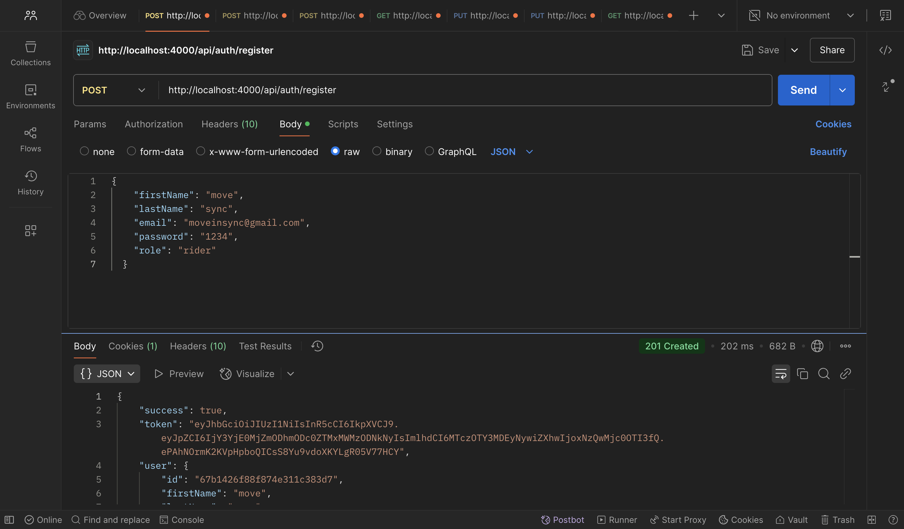

# GoTogether - Carpooling System


## Overview
GoTogether is a modern carpooling system that connects drivers with riders, making commuting more efficient and environmentally friendly. The platform features real-time ride matching, user authentication, and a sophisticated ride management system.

> **Note**: In all API examples below, replace `http://localhost:4000` with the hosted server URL when using the production environment.

## Features
- 🚗 Real-time ride matching and tracking
- 👥 User authentication and authorization
- 🗺️ Location-based ride search
- 💰 Ride fare calculation
- 🔍 Advanced ride filtering based on preferences
- 📊 Prometheus metrics integration
- 📈 Grafana dashboard support

## Demo
[Link to demo video](https://drive.google.com/file/d/1R1uaxlzuwCpaUR-7_5H5QymOQJKUq1ht/view?usp=sharing)

## API Documentation & Examples

### Base URL
- Development: `http://localhost:4000`
- Production: `[Your hosted server URL]` (Replace this with your actual hosted server URL)

### Authentication APIs

#### 1. Register User
- **Endpoint**: POST `/api/auth/register`
- **Description**: Register a new user (driver/rider)



#### 2. Login User
- **Endpoint**: POST `/api/auth/login`
- **Description**: Authenticate user and get JWT token


### Ride Management APIs

#### 1. Create Ride
- **Endpoint**: POST `/api/rides/createRide`
- **Description**: Create a new ride offering


#### 2. Get All Rides
- **Endpoint**: GET `/api/rides/getRides`
- **Description**: Fetch all available rides


#### 3. Get Best Matching Rides
- **Endpoint**: GET `/api/rides/bestRides`
- **Description**: Get rides based on location and preferences


#### 4. Request Ride
- **Endpoint**: PUT `/api/rides/:id/request`
- **Description**: Request to join a ride


#### 5. Approve/Reject Ride Request
- **Endpoint**: PUT `/api/rides/:id/approval`
- **Description**: Driver can approve or reject ride requests


## Database Structure

### MongoDB Collections

#### Users Collection
Shows the structure of user data including authentication details and preferences.


#### Rides Collection
Displays ride information including locations, status, and passenger details.


## Tech Stack
- **Backend**: Node.js, Express.js
- **Database**: MongoDB
- **Authentication**: JWT (JSON Web Tokens)
- **Monitoring**: Prometheus & Grafana
- **Real-time Communication**: Socket.IO
- **Documentation**: Swagger/OpenAPI

## Prerequisites
- Node.js (v14 or higher)
- MongoDB
- Docker & Docker Compose (for monitoring setup)

## Installation

1. Clone the repository:
```bash
git clone https://github.com/vipulbeniwal01/GoTogether-server.git
cd GoTogether-server
```

2. Install dependencies:
```bash
npm install
```

3. Create a .env file in the root directory:
```env
# Server Configuration
PORT=4000  # Port for local development
NODE_ENV=development  # Use 'production' for production environment

# Database Configuration
MONGO_URI=your_mongodb_uri  # Your MongoDB connection string

# Authentication
JWT_SECRET=your_jwt_secret  # Strong secret key for JWT tokens
JWT_EXPIRE=7d  # Token expiration time

# Frontend Configuration
FRONTEND_URL=http://localhost:3000  # Your frontend application URL

# For Production Environment
# PORT=80  # Standard HTTP port for production
# NODE_ENV=production
# FRONTEND_URL=[Your frontend production URL]
# MONGO_URI=[Your production MongoDB URI]
```

> **Note**: For production deployment:
> 1. Replace all localhost URLs with your actual domain
> 2. Use strong, secure values for JWT_SECRET
> 3. Configure proper CORS settings in `server.js`
> 4. Set up proper environment variables on your hosting platform

4. Start the server:
```bash
# Development mode
npm run dev

# Production mode
npm start
```


## API Endpoints

### Available Endpoints

| Category | Method | Endpoint | Description | Authentication Required |
|----------|---------|-----------|-------------|----------------------|
| **Authentication** |
| | POST | `/api/auth/register` | Register a new user (driver/rider) | No |
| | POST | `/api/auth/login` | Login and get JWT token | No |
| **Ride Management** |
| | POST | `/api/rides/createRide` | Create a new ride offering | Yes |
| | GET | `/api/rides/getRides` | Get all available rides | No |
| | GET | `/api/rides/bestRides` | Get best matching rides based on location | No |
| | PUT | `/api/rides/:id/request` | Request to join a ride | Yes |
| | PUT | `/api/rides/:id/approval` | Approve/reject ride requests | Yes (Driver only) |

### Request/Response Examples
See the API Documentation section above for detailed request/response examples with Postman screenshots.

## Monitoring Setup

The project includes Prometheus and Grafana setup for monitoring:

1. Start the monitoring stack:
```bash
docker-compose up -d
```

2. Access monitoring dashboards:
- Prometheus: http://localhost:9090
- Grafana: http://localhost:3001 (admin/admin)

## Project Structure
```
GoTogether-server/
├── controllers/
│   ├── auth.js
│   └── rides.js
├── middleware/
│   └── auth.js
├── models/
│   ├── Ride.js
│   └── User.js
├── routes/
│   ├── auth.js
│   └── rides.js
├── docker-compose.yml
├── prometheus.yml
├── server.js
└── package.json
```

## Contributing
1. Fork the repository
2. Create your feature branch (`git checkout -b feature/AmazingFeature`)
3. Commit your changes (`git commit -m 'Add some AmazingFeature'`)
4. Push to the branch (`git push origin feature/AmazingFeature`)
5. Open a Pull Request

## License
This project is licensed under the MIT License - see the LICENSE file for details.

